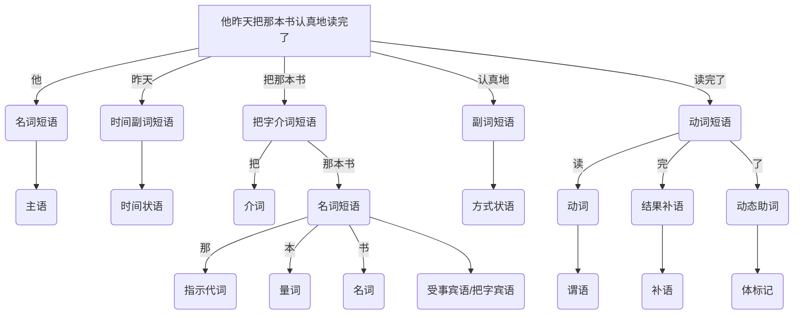

##### [[OpenText.索引.汉语|汉语]]
- 汉语
	- **汉语**是一种起源于中国的[[自然语言]], 属于汉藏语系, 其语法以分析型结构为主, 音系以声调为显著特征, 词汇和语法在历史演变中形成多种地域与社会变体. 汉语目前以汉民族为主要使用者, 是中华文明的主要载体. 汉语成为真正世界语言的路径, 不在于语言结构本身的优越性, 而在于其所承载与传播的科学知识, 技术成果与现代文明内容

