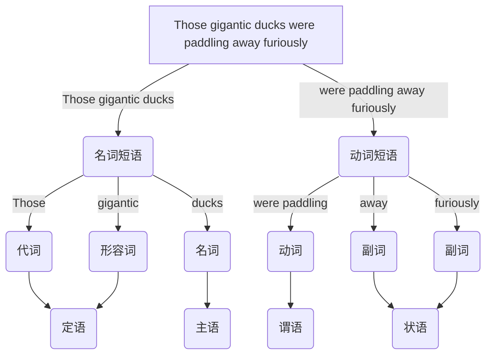

##### [[OpenText.索引.英语|英语]]
- 英语
	- **英语**是一种起源于英格兰的[[自然语言]], 属于印欧语系, 其语法以分析性结构为主, 词汇来源高度混合. 英语通过历史扩张形成多种地域与社会变体, 现已成为全球范围内最重要的通用语言之一. 英语学习容围绕语言系统的各个层次展开. 英语语音学习英语发音规则, 是口语表达与听力理解的基础. 英语书写关注英语的字母系统, 拼写规则与标点使用. 英语词法关注词汇的构成方式, 词性变化与派生规律, 涵盖词根, 词缀与屈折变化等形态现象. 英语句法学习词语如何组合成合法句子, 包括短语结构, 句子成分, 时态与语态等语法规则. 英语语义与语用关注词句的意义及其在具体语境中的恰当使用

