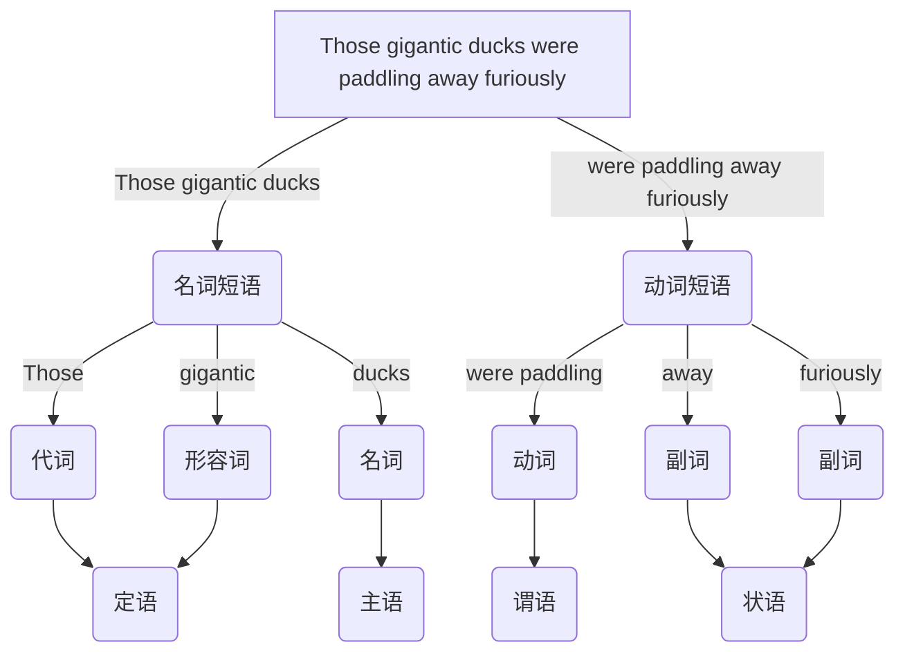

##### 英语说明
- 英语说明
	- 本文档试图提供一个融洽的语法框架, 表述难免存在矛盾冲突, 也会忽视细枝末节的语法比如单个词的应用, 单词包压缩文件位于目录 `\笔记\人文社科\英语`. 在[[自然语言]]语法理论中, 功能语法强调句子的语法功能, 如主语表示主题, 宾语表示受事, 而成分语法将句子分析为若干层次的短语成分, 强调句法结构的分层性, 如主语通常对应名词短语, 谓语对应动词短语. 下图是自然语言的语法树类似于编程语言的抽象语法树, 用于生成语法理论和自然语言处理等. 不管什么语法, 有限的规则难以完全表示自然语言, 总有例外难以自洽

