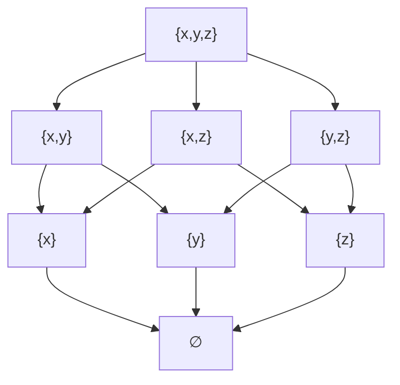

##### 哈斯图
- 哈斯图
	- **哈斯图**是用来表示有限[[偏序关系|偏序集]]的一种数学图表, 哈斯图本质上是[[有向无环图]]. 集合 $S = \{ x, y, z \}$ 的幂集为 $\mathcal{P}(S) = \{ \emptyset, \{x\}, \{y\}, \{z\}, \{x, y\}, \{x, z\}, \{y, z\}, \{x, y, z\} \}$, 按[[包含序]] $\subseteq$ 进行偏序排序, 其哈斯图如下

